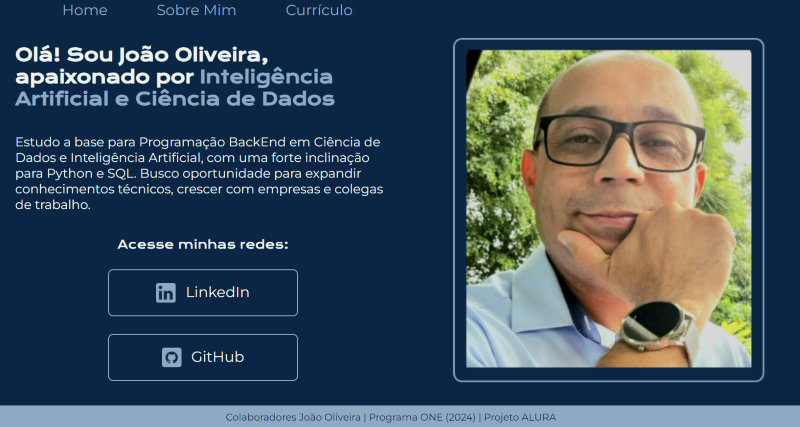

### PROJETO PORTFOLIO INDIVIDUAL - ALURA | ONE

   

### Tópicos 

- [Descrição do projeto](#descrição-do-projeto)

- [Funcionalidades](#funcionalidades)

- [Ferramentas utilizadas](#ferramentas-utilizadas)

- [Acesso ao projeto](#acesso-ao-projeto)

- [Colaboradores](#colaboradores)

## Descrição do projeto 

Projeto em desenvolvimento na Formação Iniciante em Programação T7 - ONE, na disciplina HTML e  CSS, com os instrutores Guilherme Lima e Rafaella Ballerini.

O site em construção oferece uma apresentação de portfolio individual para seu próprio pitch de vendas com responsividade em diversas plataformas e dispositivos.

## Funcionalidades

`Funcionalidade 1:` Interface amigável com pitch de apresentação e principais redes sociais.

`Funcionalidade 2:` Ampliação do projeto como criação de meno no cabeçalho e mais uma aba descritiva sobre mim.

`Funcionalidade 3:` Novos links estruturados com FlexBox.

`Funcionalidade 4:` Indicação de autoria, colaboradores e desenvolvimento.

## Ferramentas utilizadas

###

## Acesso ao projeto

Você pode [acessar o código fonte do projeto](https://github.com/jjofilho/Portfolio).

## Colaboradores

| [  João Oliveira](https://github.com/jjofilho) | [ Rafaella Ballerini](https://github.com/rafaballerini) | [ Guilherme Lima](https://github.com/guilhermeonrails) |  [ Alura Cursos Online](https://github.com/alura-cursos) |
| :---: | :---: | :---: | :---: |

